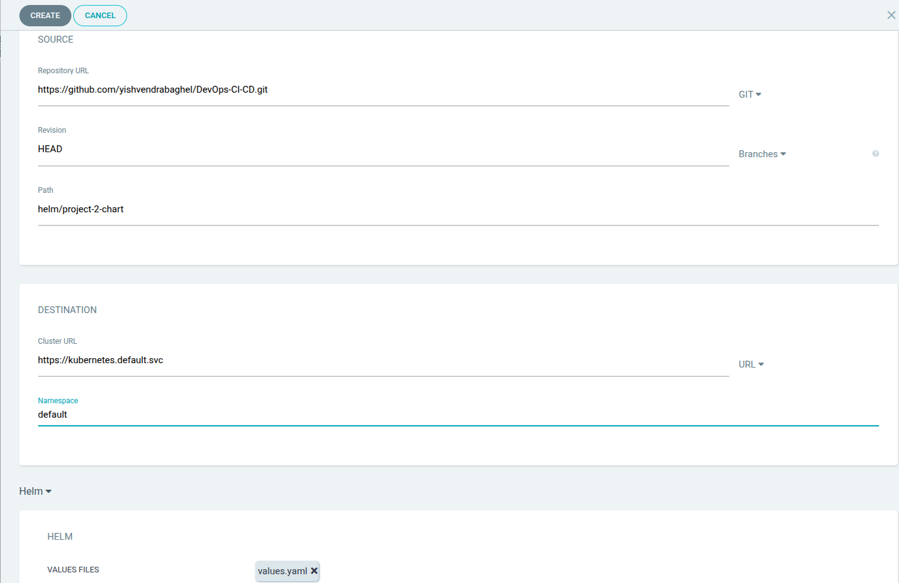

# DevOpsified Go Application 🚀

This project automates the deployment of a Go Application 🌐 using modern DevOps practices, including **containerization 🐳**, **orchestration ♸️**, and **continuous delivery 🔄**. The app was provided by a developer, and I have enhanced it with Helm and GitOps principles for efficient deployments.

---

## Key Steps and Features ⭐

1. **Dockerization 🐳**:  
   - A `Dockerfile` was created with the necessary build commands to containerize the application.  
   - The image was built and pushed to Docker Hub.  

2. **Kubernetes Resources ♸️**:  
   - Created the following manifests for the app:  
     - `deployment.yaml`: Defines pods and container specifications.  
     - `service.yaml`: Exposes the app via a ClusterIP service.  
     - `ingress.yaml`: Manages external access using the NGINX Ingress Controller.  
   - Install NGINX Ingress Controller:  
     ```bash
     kubectl apply -f https://raw.githubusercontent.com/kubernetes/ingress-nginx/controller-v1.12.0/deploy/static/provider/cloud/deploy.yaml
     ```

3. **Host Configuration 🛠️**:  
   - Added an entry to `/etc/hosts` with the **ALB link** and associated IP address (retrieved using the `nslookup` command).  

   it should look like this :-
   ```bash
   a9e4540138f464580944f8ca5d0d69ac-1482153858.us-east-1.elb.amazonaws.com project-2.local
   34.195.87.75 project-2.local
   ```


4. **Helm Integration ⚓**:  
   - Developed a Helm chart for better configurability and reusability of Kubernetes deployments.  

5. **GitOps and CI/CD 🔄**:  
   - **GitHub Actions**: Configured CI pipelines to build and push Docker images automatically.  
   - **ArgoCD 🎯**: Used for CD to synchronize Helm charts and Kubernetes manifests seamlessly.  

---

## Environment Setup ✅

### Prerequisites
Ensure you have the following tools installed:  
- 🐳 Docker  
- ♸️ Kubernetes (Minikube 🏦, Kind 🏕️, or a cloud provider ☁️ cluster)  
- ⚓ Helm  
- 🎯 ArgoCD  
- 💻 Go (optional, for local testing)  

---

## Deployment Process 🏁

### 1. **Running Locally**
To run the app locally:  
```bash
go run main.go
```  
Access the app at: `http://localhost:8080/courses`  

### 2. **Deploying to Kubernetes**

#### Using Helm
1. Navigate to the Helm chart directory:  
   ```bash
   cd helm/project-2-chart
   ```  
2. Install the chart:  
   ```bash
   helm install project-2 .
   ```  
3. Verify the deployment:  
   ```bash
   kubectl get pods
   ```  

#### Using Raw Kubernetes Manifests
1. Apply the Kubernetes resources:  
   ```bash
   kubectl apply -f k8s/deployment.yaml
   kubectl apply -f k8s/ingress.yaml
   kubectl apply -f k8s/services.yaml
   ```  
2. Verify the deployment:  
   ```bash
   kubectl get pods
   ```  

---

### 3. **GitHub Actions Configuration**
To automate CI, set the following secrets in your GitHub repository:  

Go to repo settings → Secrets and Variables → Actions → Create new secrets:

- **DOCKER_USERNAME**: Your Docker Hub username.  
- **DOCKER_PASSWORD**: Docker Hub access token.  
  - To create a Docker Hub token:  
    1. Click your profile icon (top-right).  
    2. Go to **Account Settings**.  
    3. Select **Personal Access Tokens** and create a new token with read/write permissions.  

- **TOKEN**: GitHub personal access token.  
  - To create a GitHub token:  
    1. Go to **Settings** → **Developer Settings** → **Personal Access Tokens (classic)**.  
    2. Generate a new token with permissions for `repo`, `workflow`, and `write:packages`.  

---

### 4. **Continuous Deployment with ArgoCD 🎯**

1. **Install ArgoCD**:  
   ```bash
   kubectl create namespace argocd
   kubectl apply -n argocd -f https://raw.githubusercontent.com/argoproj/argo-cd/v2.4.7/manifests/install.yaml
   ```  

2. **Expose the ArgoCD Server**:  
   ```bash
   kubectl patch svc argocd-server -n argocd -p '{"spec": {"type": "LoadBalancer"}}'
   ```  

3. **Retrieve the Default Password**:  
   ```bash
   kubectl -n argocd get secret argocd-initial-admin-secret -o jsonpath="{.data.password}" | base64 -d
   ```  

4. **Log in to ArgoCD**:  
   - Use the default credentials (refer to ArgoCD documentation).  

5. **Create a New Application in ArgoCD**:  
   - Link it to your GitHub repository containing the Helm charts and Kubernetes manifests.  
   - Once synced, ArgoCD will automatically deploy updates.  

#### Screenshots 📸

  
  
  
  

---


## Future Improvements 🔮

- Integrate monitoring with **Prometheus** and **Grafana**.  
- Implement centralized logging with the **ELK stack**.  
- Enable **auto-scaling** using Horizontal Pod Autoscalers (HPA).  

---

Feel free to clone this project, explore it, and contribute! 🎉
